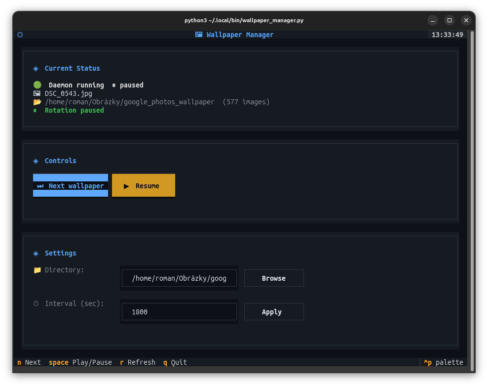
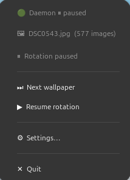

# 🖼 Wallpaper Manager

Automatic random wallpaper rotation for **GNOME on Wayland**.


Consists of three parts:

* **`wallpaper_daemon.py`** — runs in the background as a systemd user service, rotates wallpapers
* **`wallpaper_manager.py`** — TUI controller in the terminal, communicates with the daemon via Unix socket
* **`wallpaper_tray.py`** — system tray app for GNOME, provides quick access to all controls from the top bar

---

## Requirements

* Python 3.10+
* GNOME + Wayland
* `textual` library (TUI controller)
* `gir1.2-ayatanaappindicator3-0.1` + GNOME extension (tray app)

```
# Python libraries
pip install textual --break-system-packages

# System tray support
sudo apt install gir1.2-ayatanaappindicator3-0.1 gnome-shell-extension-appindicator
gnome-extensions enable ubuntu-appindicators@ubuntu.com
```

> **Note:** After enabling the GNOME extension, log out and back in for the tray icon to appear.

---
## Screenshots

### Wallpaper manager (TUI)


### Wallpaper try


---

## Installation

```
# 1. Copy the scripts
mkdir -p ~/.local/bin
cp wallpaper_daemon.py ~/.local/bin/
cp wallpaper_manager.py ~/.local/bin/
cp wallpaper_tray.py ~/.local/bin/

# 2. Install the systemd service
mkdir -p ~/.config/systemd/user
cp wallpaper-daemon.service ~/.config/systemd/user/

# 3. Start the daemon
systemctl --user daemon-reload
systemctl --user enable wallpaper-daemon
systemctl --user start wallpaper-daemon

# 4. (Optional) Add tray app to autostart
mkdir -p ~/.config/autostart
cp wallpaper-tray.desktop ~/.config/autostart/
```

The daemon will start automatically on every login. The tray app can be started manually or via autostart.

---

## Usage

### TUI Controller

```
python3 ~/.local/bin/wallpaper_manager.py
```

| Key | Action |
| --- | --- |
| `N` | Immediately change wallpaper |
| `Space` | Pause / Resume rotation |
| `R` | Refresh status |
| `Q` | Close TUI |

### Daemon Management

```
# Status
systemctl --user status wallpaper-daemon

# Stop / Start / Restart
systemctl --user stop wallpaper-daemon
systemctl --user start wallpaper-daemon
systemctl --user restart wallpaper-daemon

# Logs
journalctl --user -u wallpaper-daemon -f
```

### Tray App

Start the tray app manually:

```
python3 ~/.local/bin/wallpaper_tray.py &
```

The tray icon appears in the GNOME top bar and changes color based on daemon state:

| Icon color | Meaning |
| --- | --- |
| 🟢 Green | Daemon running |
| 🟠 Orange | Rotation paused |
| 🔴 Red | Daemon not running |

Right-clicking the icon opens a menu with: current wallpaper name, countdown to next change, next wallpaper, pause/resume, settings (directory + interval), and quit.

---

## Configuration

The config is automatically saved to `~/.config/wallpaper-manager/config.json`:

```
{
  "wallpaper_dir": "/home/user/wallpapers",
  "interval": 300
}
```

| Parameter | Description | Default value |
| --- | --- | --- |
| `wallpaper_dir` | Directory with wallpapers (including subdirectories) | `~/wallpapers` |
| `interval` | Rotation interval in seconds | `300` (5 minutes) |

Supported formats: `.jpg`, `.jpeg`, `.png`, `.webp`, `.bmp`

---

## File Structure

```
~/.local/bin/
├── wallpaper_daemon.py       # daemon (date/time overlay, rotation)
├── wallpaper_manager.py      # TUI controller
└── wallpaper_tray.py         # system tray app

~/.config/systemd/user/
└── wallpaper-daemon.service  # systemd service

~/.config/autostart/
└── wallpaper-tray.desktop    # tray app autostart entry

~/.config/wallpaper-manager/
├── config.json               # configuration
├── daemon.sock               # Unix socket (created at runtime)
└── daemon.log                # log file
```

---

## Troubleshooting

**Daemon not running after restart:**

```
loginctl enable-linger $USER
systemctl --user daemon-reload
systemctl --user enable wallpaper-daemon
```

**Wallpaper not changing (Wayland/GNOME):**

```
# Check if gsettings works
gsettings get org.gnome.desktop.background picture-uri
```

**Tray icon not visible:**

```
# Make sure the GNOME extension is enabled
gnome-extensions enable ubuntu-appindicators@ubuntu.com
# Then log out and back in
```

**TUI reports "Daemon unavailable":**

```
systemctl --user start wallpaper-daemon
journalctl --user -u wallpaper-daemon -n 20
```

## Support

If you find this tool useful, consider supporting development:

[](https://ko-fi.com/rpastierik)
